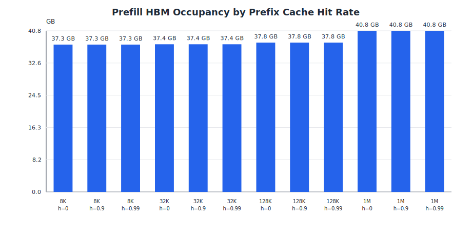
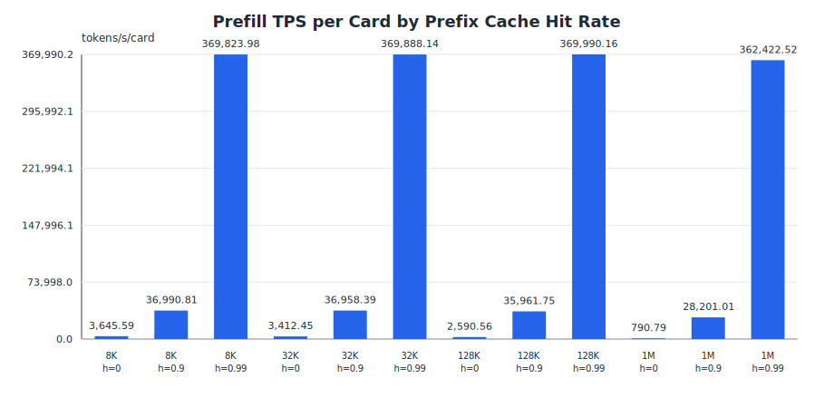
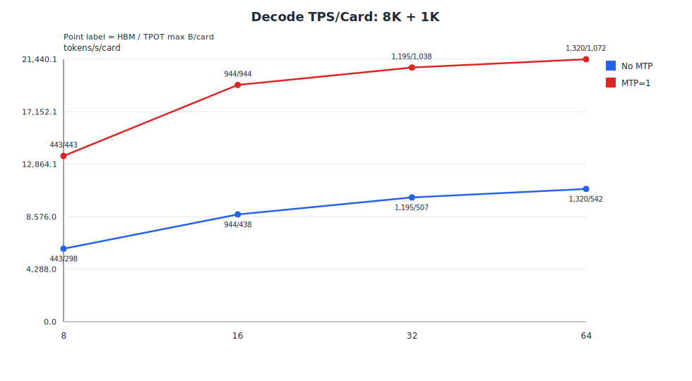
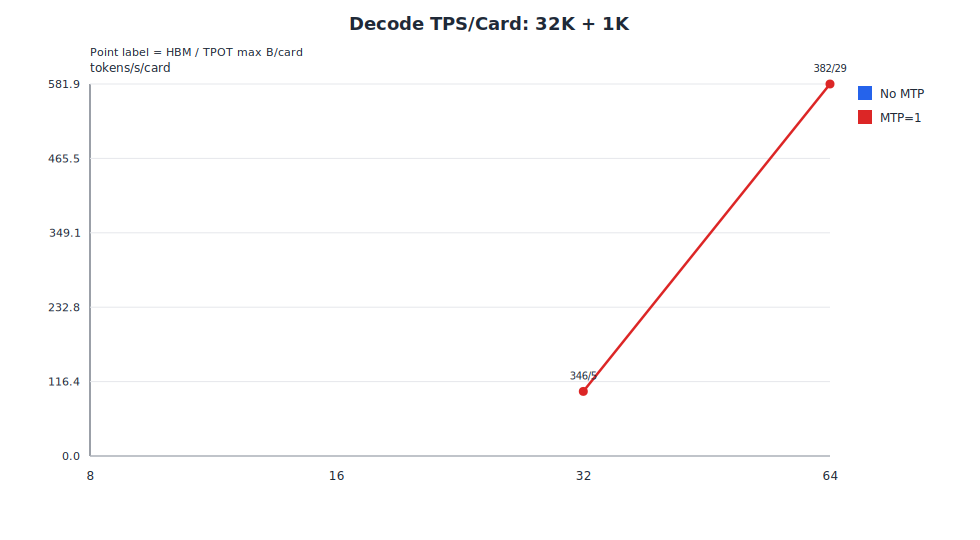
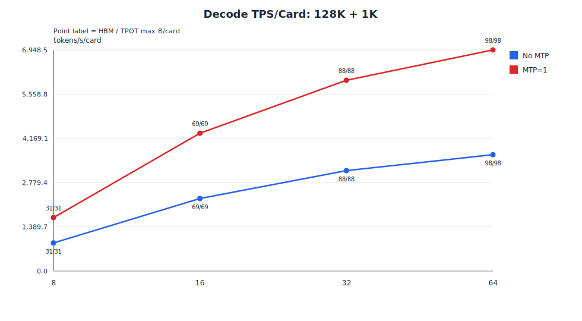
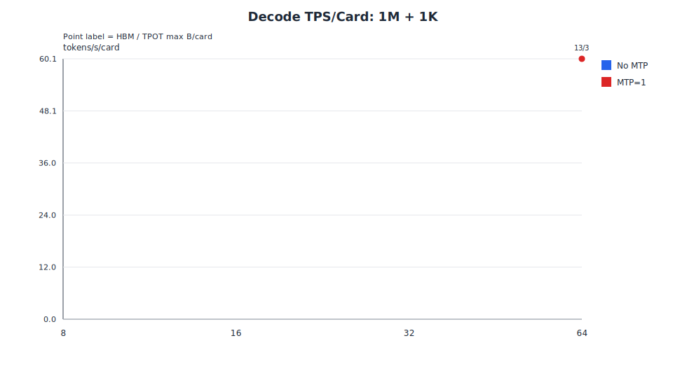
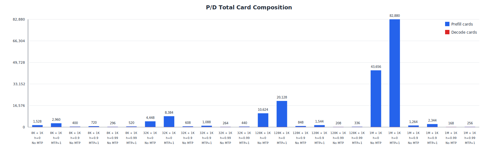

# 0428 PD 分离推理分析报告

## 结论摘要

- 8K + 1K（h=0）：推荐 Decode MTP=1，P/D=362P:1D，总卡数 2960。
- 8K + 1K（h=0.9）：推荐 Decode MTP=1，P/D=82P:1D，总卡数 720。
- 8K + 1K（h=0.99）：推荐 Decode MTP=1，P/D=57P:1D，总卡数 520。
- 32K + 1K（h=0）：推荐 Decode MTP=1，P/D=1040P:1D，总卡数 8384。
- 32K + 1K（h=0.9）：推荐 Decode MTP=1，P/D=128P:1D，总卡数 1088。
- 32K + 1K（h=0.99）：推荐 Decode MTP=1，P/D=47P:1D，总卡数 440。
- 128K + 1K（h=0）：推荐 Decode MTP=1，P/D=2508P:1D，总卡数 20128。
- 128K + 1K（h=0.9）：推荐 Decode MTP=1，P/D=185P:1D，总卡数 1544。
- 128K + 1K（h=0.99）：推荐 Decode MTP=1，P/D=34P:1D，总卡数 336。
- 1M + 1K（h=0）：推荐 Decode MTP=1，P/D=10352P:1D，总卡数 82880。
- 1M + 1K（h=0.9）：推荐 Decode MTP=1，P/D=285P:1D，总卡数 2344。
- 1M + 1K（h=0.99）：推荐 Decode MTP=1，P/D=24P:1D，总卡数 256。

## 假设与配置

| 项目 | 取值 |
| --- | --- |
| 硬件 | Ascend 910C |
| 模型 | DeepSeek V4 Flash |
| 量化 | w8a8 |
| KV Cache 量化 | kv8 |
| W8A8 GEMM 吞吐 | 752.0 TFLOPS |
| HBM 容量/预留/可用 | 64 GB / 10.0% / 57.6 GB |
| prefix_cache_hit_rate | 0.00, 0.90, 0.99 |
| MTP accept ratio | 0.90 |
| TPOT 约束 | 50.0 ms |

## 场景

| 场景 | Prefill 输入长度 | Decode 输出长度 |
| --- | --- | --- |
| 8K + 1K | 8,192 | 1,024 |
| 32K + 1K | 32,768 | 1,024 |
| 128K + 1K | 131,072 | 1,024 |
| 1M + 1K | 1,000,000 | 1,024 |

## 公式

- Prefix cache：`L_miss = ceil(input_len * (1 - prefix_cache_hit_rate))`，Prefill compute 使用 `F_prefill(L_miss)`，HBM 仍按完整 input context 计算。
- MTP：`tokens_per_forward = 1 + mtp * mtp_accept_ratio`，`decode_forward_count = ceil(output_len / tokens_per_forward)`。
- Decode TPOT：`TPOT = decode_total_time / output_len`，本报告过滤 `TPOT <= 50 ms`。
- HBM：`weight_bytes_quant + kv_bytes_quant`，W8A8 权重按 0.5，KV8 cache 按 0.5。
- P/D 配比：使用 instance QPS，求 `prefill_instances * prefill_qps ~= decode_instances * decode_qps`，容忍 10% imbalance。

## Prefill 分析

Prefill 按 `batch_size=1` 搜索模型权重加完整输入 KV cache 可以放入 HBM 的最小实例卡数。

| 场景 | Hit | 卡数 | TP | EP | DP | BS | B/card | L_miss | Weight GB | KV GB | HBM GB | Prefill ms | QPS | TPS/card |
| --- | --- | --- | --- | --- | --- | --- | --- | --- | --- | --- | --- | --- | --- | --- |
| 8K + 1K | 0.00 | 8 | 8 | 8 | 1 | 1 | 0.12 | 8,192 | 37.27 | 0.03 | 37.30 | 299.82 | 3.34 | 3,415.39 |
| 8K + 1K | 0.90 | 8 | 8 | 8 | 1 | 1 | 0.12 | 820 | 37.27 | 0.03 | 37.30 | 67.96 | 14.72 | 15,068.16 |
| 8K + 1K | 0.99 | 8 | 8 | 8 | 1 | 1 | 0.12 | 82 | 37.27 | 0.03 | 37.30 | 46.48 | 21.52 | 22,032.17 |
| 32K + 1K | 0.00 | 8 | 8 | 8 | 1 | 1 | 0.12 | 32,768 | 37.27 | 0.12 | 37.39 | 1,174.51 | 0.85 | 3,487.42 |
| 32K + 1K | 0.90 | 8 | 8 | 8 | 1 | 1 | 0.12 | 3,277 | 37.27 | 0.12 | 37.39 | 143.82 | 6.95 | 28,479.21 |
| 32K + 1K | 0.99 | 8 | 8 | 8 | 1 | 1 | 0.12 | 328 | 37.27 | 0.12 | 37.39 | 53.09 | 18.84 | 77,155.07 |
| 128K + 1K | 0.00 | 8 | 8 | 8 | 1 | 1 | 0.12 | 131,072 | 37.36 | 0.45 | 37.81 | 6,288.32 | 0.16 | 2,605.47 |
| 128K + 1K | 0.90 | 8 | 8 | 8 | 1 | 1 | 0.12 | 13,108 | 37.36 | 0.45 | 37.81 | 462.23 | 2.16 | 35,445.21 |
| 128K + 1K | 0.99 | 8 | 8 | 8 | 1 | 1 | 0.12 | 1,311 | 37.36 | 0.45 | 37.81 | 82.99 | 12.05 | 197,414.73 |
| 1M + 1K | 0.00 | 8 | 8 | 8 | 1 | 1 | 0.12 | 1,000,000 | 37.36 | 3.44 | 40.80 | 160,291.41 | 0.01 | 779.83 |
| 1M + 1K | 0.90 | 8 | 8 | 8 | 1 | 1 | 0.12 | 100,000 | 37.36 | 3.44 | 40.80 | 4,399.96 | 0.23 | 28,409.38 |
| 1M + 1K | 0.99 | 8 | 8 | 8 | 1 | 1 | 0.12 | 10,000 | 37.36 | 3.44 | 40.80 | 358.82 | 2.79 | 348,362.68 |

## Decode 分析

表中 `HBM B/card` 是不考虑 TPOT、只受 HBM 限制的最大单卡 batch；`TPOT B/card` 是同时满足 TPOT<=50ms 的最大单卡 batch。
按当前建模，prefix cache 只影响 prefill compute，不影响 decode compute/HBM，因此 decode 曲线不按 hit rate 重复。

### 8K + 1K

| 模式 | 卡数 | HBM B/card | TPOT B/card | TP | EP | DP | TPOT ms | TPS/card | QPS | Best |
| --- | --- | --- | --- | --- | --- | --- | --- | --- | --- | --- |
| No MTP | 8 | 443 | 298 | 1 | 8 | 8 | 49.97 | 5,963.30 | 46.59 | No |
| No MTP | 16 | 944 | 438 | 1 | 16 | 16 | 49.96 | 8,767.77 | 137.00 | No |
| No MTP | 32 | 1,195 | 507 | 1 | 32 | 32 | 49.92 | 10,155.31 | 317.35 | No |
| No MTP | 64 | 1,320 | 542 | 1 | 64 | 64 | 49.97 | 10,847.19 | 677.95 | Yes |
| MTP=1 | 8 | 443 | 443 | 1 | 8 | 8 | 32.71 | 13,543.90 | 105.81 | No |
| MTP=1 | 16 | 944 | 944 | 1 | 16 | 16 | 48.80 | 19,343.24 | 302.24 | No |
| MTP=1 | 32 | 1,195 | 1,038 | 1 | 32 | 32 | 49.98 | 20,767.94 | 649.00 | No |
| MTP=1 | 64 | 1,320 | 1,072 | 1 | 64 | 64 | 50.00 | 21,440.12 | 1,340.01 | Yes |

### 32K + 1K

| 模式 | 卡数 | HBM B/card | TPOT B/card | TP | EP | DP | TPOT ms | TPS/card | QPS | Best |
| --- | --- | --- | --- | --- | --- | --- | --- | --- | --- | --- |
| No MTP | 8 | 128 | 128 | 1 | 8 | 8 | 39.52 | 3,238.57 | 25.30 | No |
| No MTP | 16 | 273 | 273 | 1 | 16 | 16 | 42.98 | 6,351.56 | 99.24 | No |
| No MTP | 32 | 346 | 346 | 1 | 32 | 32 | 45.10 | 7,671.35 | 239.73 | No |
| No MTP | 64 | 382 | 382 | 1 | 64 | 64 | 46.13 | 8,281.81 | 517.61 | Yes |
| MTP=1 | 8 | 128 | 128 | 1 | 8 | 8 | 20.80 | 6,152.68 | 48.07 | No |
| MTP=1 | 16 | 273 | 273 | 1 | 16 | 16 | 22.62 | 12,066.79 | 188.54 | No |
| MTP=1 | 32 | 346 | 346 | 1 | 32 | 32 | 23.74 | 14,574.13 | 455.44 | No |
| MTP=1 | 64 | 382 | 382 | 1 | 64 | 64 | 24.28 | 15,733.90 | 983.37 | Yes |

### 128K + 1K

| 模式 | 卡数 | HBM B/card | TPOT B/card | TP | EP | DP | TPOT ms | TPS/card | QPS | Best |
| --- | --- | --- | --- | --- | --- | --- | --- | --- | --- | --- |
| No MTP | 8 | 31 | 31 | 1 | 8 | 8 | 34.89 | 888.62 | 6.94 | No |
| No MTP | 16 | 69 | 69 | 1 | 16 | 16 | 29.88 | 2,308.94 | 36.08 | No |
| No MTP | 32 | 88 | 88 | 1 | 32 | 32 | 27.41 | 3,210.88 | 100.34 | No |
| No MTP | 64 | 98 | 98 | 1 | 64 | 64 | 26.27 | 3,731.13 | 233.20 | Yes |
| MTP=1 | 8 | 31 | 31 | 1 | 8 | 8 | 18.36 | 1,688.21 | 13.19 | No |
| MTP=1 | 16 | 69 | 69 | 1 | 16 | 16 | 15.73 | 4,386.56 | 68.54 | No |
| MTP=1 | 32 | 88 | 88 | 1 | 32 | 32 | 14.43 | 6,100.07 | 190.63 | No |
| MTP=1 | 64 | 98 | 98 | 1 | 64 | 64 | 13.83 | 7,088.45 | 443.03 | Yes |

### 1M + 1K

| 模式 | 卡数 | HBM B/card | TPOT B/card | TP | EP | DP | TPOT ms | TPS/card | QPS | Best |
| --- | --- | --- | --- | --- | --- | --- | --- | --- | --- | --- |
| No MTP | 8 | 4 | 4 | 1 | 8 | 8 | 33.28 | 120.20 | 0.94 | No |
| No MTP | 16 | 9 | 9 | 1 | 16 | 16 | 26.41 | 340.84 | 5.33 | No |
| No MTP | 32 | 11 | 11 | 1 | 32 | 32 | 22.46 | 489.84 | 15.31 | No |
| No MTP | 64 | 13 | 13 | 1 | 64 | 64 | 21.51 | 604.31 | 37.77 | Yes |
| MTP=1 | 8 | 4 | 4 | 1 | 8 | 8 | 17.52 | 228.36 | 1.78 | No |
| MTP=1 | 16 | 9 | 9 | 1 | 16 | 16 | 13.90 | 647.53 | 10.12 | No |
| MTP=1 | 32 | 11 | 11 | 1 | 32 | 32 | 11.82 | 930.61 | 29.08 | No |
| MTP=1 | 64 | 13 | 13 | 1 | 64 | 64 | 11.32 | 1,148.07 | 71.75 | Yes |

## P/D 配比

| 场景 | Hit | Decode 模式 | Prefill 卡/实例 | Decode 卡/实例 | P:D | imbalance | 总卡数 | 推荐 |
| --- | --- | --- | --- | --- | --- | --- | --- | --- |
| 8K + 1K | 0.00 | No MTP | 8 | 64 | 183P:1D | 0.10 | 1,528 | No |
| 8K + 1K | 0.00 | MTP=1 | 8 | 64 | 362P:1D | 0.10 | 2,960 | Yes |
| 8K + 1K | 0.90 | No MTP | 8 | 64 | 42P:1D | 0.09 | 400 | No |
| 8K + 1K | 0.90 | MTP=1 | 8 | 64 | 82P:1D | 0.10 | 720 | Yes |
| 8K + 1K | 0.99 | No MTP | 8 | 64 | 29P:1D | 0.08 | 296 | No |
| 8K + 1K | 0.99 | MTP=1 | 8 | 64 | 57P:1D | 0.08 | 520 | Yes |
| 32K + 1K | 0.00 | No MTP | 8 | 64 | 548P:1D | 0.10 | 4,448 | No |
| 32K + 1K | 0.00 | MTP=1 | 8 | 64 | 1040P:1D | 0.10 | 8,384 | Yes |
| 32K + 1K | 0.90 | No MTP | 8 | 64 | 68P:1D | 0.09 | 608 | No |
| 32K + 1K | 0.90 | MTP=1 | 8 | 64 | 128P:1D | 0.09 | 1,088 | Yes |
| 32K + 1K | 0.99 | No MTP | 8 | 64 | 25P:1D | 0.09 | 264 | No |
| 32K + 1K | 0.99 | MTP=1 | 8 | 64 | 47P:1D | 0.10 | 440 | Yes |
| 128K + 1K | 0.00 | No MTP | 8 | 64 | 1320P:1D | 0.10 | 10,624 | No |
| 128K + 1K | 0.00 | MTP=1 | 8 | 64 | 2508P:1D | 0.10 | 20,128 | Yes |
| 128K + 1K | 0.90 | No MTP | 8 | 64 | 98P:1D | 0.09 | 848 | No |
| 128K + 1K | 0.90 | MTP=1 | 8 | 64 | 185P:1D | 0.10 | 1,544 | Yes |
| 128K + 1K | 0.99 | No MTP | 8 | 64 | 18P:1D | 0.07 | 208 | No |
| 128K + 1K | 0.99 | MTP=1 | 8 | 64 | 34P:1D | 0.08 | 336 | Yes |
| 1M + 1K | 0.00 | No MTP | 8 | 64 | 5449P:1D | 0.10 | 43,656 | No |
| 1M + 1K | 0.00 | MTP=1 | 8 | 64 | 10352P:1D | 0.10 | 82,880 | Yes |
| 1M + 1K | 0.90 | No MTP | 8 | 64 | 150P:1D | 0.10 | 1,264 | No |
| 1M + 1K | 0.90 | MTP=1 | 8 | 64 | 285P:1D | 0.10 | 2,344 | Yes |
| 1M + 1K | 0.99 | No MTP | 8 | 64 | 13P:1D | 0.04 | 168 | No |
| 1M + 1K | 0.99 | MTP=1 | 8 | 64 | 24P:1D | 0.07 | 256 | Yes |

## 建模边界

- 未建模 quant/dequant kernel 时间。
- Prefix cache 当前只降低 prefill compute，不降低 HBM；q_len/ctx_len 细分 attention 语义列为后续工作。
- MTP 只按平均接收 token 数折算 forward 次数，未加入额外 head 权重或 MTP 专属计算开销。
- 未建模 P/D KV transfer、排队、动态 batching、拓扑放置和 allocator fragmentation 以外的额外 HBM 损耗。
